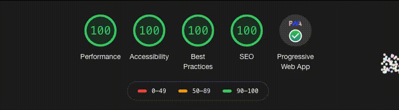

# ✍️ MiroPad

> Temporary note keeping app for the browser

Also hosted on IPFS: https://miropad.on.fleek.co

## Usage

```commands
Ctrl/⌘ + Shift + P
```

to explore the available commands on the command palette

## Development

Start development

```bash
  npm run dev
```

Deploy

```bash
  npm run deploy
```

## Lighthouse Audit results


